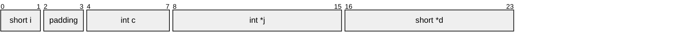
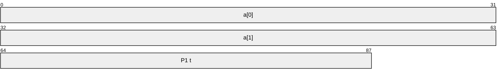

# Chapter 3 Machine-Level Representation of Programs


<!-- vim-markdown-toc GFM -->

1. [Section 3.5 Arithmetic and Logical Operations](#section-35-arithmetic-and-logical-operations)
	1. [Page 233, Practice Problem 3.10](#page-233-practice-problem-310)

1. [Section 3.6 Control](#section-36-control)
    1. [Page 240, Practical Problem 3.13 (corrected)](#page-240-practical-problem-313-corrected)
    1. [Page 248, Practice Problem 3.16](#page-248-practice-problem-316)
    1. [Page 255, Practice Problem 3.21](#page-255-practice-problem-321)  
    1. [Page 258, Practice Problem 3.23](#page-258-practice-problem-323)
    1. [Page 264, Practice Problem 3.26](#page-264-practice-problem-326) 
    1. [Page 274, Figure 3.24 (code of Practice Problem 3.31)](#page-274-figure-324-code-of-practice-problem-331)
1. [Section 3.8 Array Allocation and Access](#section-38-array-allocation-and-access)
    1. [Page 298, Practice Problem 3.40](#page-298-practice-problem-340)
1. [Section 3.9 Heterogeneous Data Structure](#section-39-heterogeneous-data-structure)
    1. [Page 304, Practice Problem 3.41](#page-304-practice-problem-341)
        1. [Aside: How can you know?](#aside-how-can-you-know)
    1. [Page 305, Practice Problem 3.42](#page-305-practice-problem-342)
    1. [Page 311, Practice Problem 3.44](#page-311-practice-problem-344) 

<!-- vim-markdown-toc -->

## Section 3.5 Arithmetic and Logical Operations
### Page 233, Practice Problem 3.10

- The assembly provided doesn't match the C code in the solution given. The solution given is the following:

```c
// solution to practice problem 3.10: in page 365
short p1 = y | z;
short p2 = p1 >> 9;
short p3 = ~p2;
short p4 = y - p3;
return p4; // return is ommited in the book's solution (for simplicity since you don't need to alter it), but it is present in the problem statement and I add it here because it is important for us to see why the problem is wrong. 
```

- The assembly provided in the problem statement is:

```asm
arith3:
	orq %rsi, %rdx
	sarq $9, %rdx
	notq %rdx
	movq %rdx, %bax
	subq %rsi, %rbx
	ret
```

The first problem we can notice in the snippet above is the `%bax` register. This register doesn't exist and is probably a typo for `%rax`.

Now the assembly becomes:

```asm
arith3:
	orq %rsi, %rsi
	sarq $9, %rdx
	notq %rdx
	movq %rdx, %rax  ; Changed %bax to %rax
	subq %rsi, %rbx
	ret
```

But this assembly code still doesn't match the solution provided. 

By convention, function return values are stored into `%rax`, so the statement `movq %rdx, %rax` indicates that this function will return whatever value is in `%rdx` at that point (in this case it's `p3`).

We can infer this because in the C solution p4 is equal to `y - p3`, and in the assembly code this subtraction is being made after setting the return value. However, the C code clearly states that `p4` should be returned, and not `p3`

Additionally, the subq instruction, right now, would translate to `p3 - y`, because `subq S, D = D <-- D - S`, which doesn't match the book's proposed solution (`y - p3`).

The problem statement's assembly code should be:

```asm
arith3:
  orq     %rsi, %rdx
  sarq    $9, %rdx
  notq    %rdx
  subq    %rdx, %rsi  ; subtract before moving, and change the order of the operands to match the book's proposed solution
  movq    %rsi, %rax  ; move to p4 (%rsi) to %rax (as stated earlier, by convention return values go into %rax)
  ret
```

## Section 3.6 Control
### Page 240, Practical Problem 3.13 (corrected)
D. 
```asm
cmpq  %rsi, %rdi
setne %a
```
The last line should be changed to
```asm
cmpq  %rsi, %rdi
setne %al
```


### Page 248, Practice Problem 3.16
```asm
cond:
  testq %rdi, %rdi
  je    .L1
  cmpq  %rsi, (%rdi)
  jle   .L1
  movq  %rdi, (%rsi)
.L1:
  rep; ret
```

The fifth line should be changed to `  cmpq  (%rsi), %rdi`

### Page 255, Practice Problem 3.21

In the solution: `else if (y > 10)` should be changed to `else if (y >= 10)`, correctly matching the `cmovge` instruction in the assembly code. For y > 10 to be correct, the assembly instruction would have to be cmovg instead.

### Page 258, Practice Problem 3.23 

The C code and assembly code do not correspond to each other, if I change
the assembly code, it should be like:
```asm
7       leaq    5(rbp, %rcx), %rbx
```
And the answer from page 370 should also be changed.

Also, the instruction `idivq` on line 4 is taking two operands, but in reality it takes only one operand. See [this](https://stackoverflow.com/questions/57998998/csapp-example-uses-idivq-with-two-operands)


### Page 264, Practice Problem 3.26

In the problem statement assembly code, in the last 2 lines, we have:

```asm
andl $0, %eax
ret
```
This translates to C code as (note: variable *val* is in %eax):
```c
return val & 0;
``` 
This always returns 0 regardless of the value that `val` holds. 

In the answer for letter C, we see that the function is supposed to be a **parity** checker. For this to be the case, we would need to compute `val & 1`.   

This means the `andl $0, %eax` instruction on the problem statement should be changed to `andl $1, %eax` (in C: `return val & 1;`)

### Page 274, Figure 3.24 (code of Practice Problem 3.31)

The second line of (the comment of) the assembly code, `%rdi and %rdi` 
are reversed and should be changed to 
```
a in %rdi, b in %rsi, c in %rdx, d in %rcx
```

## Section 3.8 Array Allocation and Access
### Page 298, Practice Problem 3.40 

The second line of the comments of the first line of assembly code should be:
```
A in %rdi, val in %esi
```

## Section 3.9 Heterogeneous Data Structure 

### Page 304, Practice Problem 3.41

In fact, some of the sub-problems are impossible to answer, and some of the 
answers from page 279 is definitely incorrect. This is due to a C language 
feature mentioned in the next of the next sub-section. According to 
C11 (6.7.2.1 14), the way of _alignment_ of `struct`'s members are 
_implement-defined_.
> Each non-bit-field member of a structure or union object is aligned in an implementation-defined manner appropriate to its type.
That is, if no compiler (and even version) specified in this question, 
there will be no answer. If it is for GCC, then according to GCC's 
documentation, it is 
> Determined by ABI. 
Meaning that GCC on different platforms may produce different result. 

Thus, this question itself is incorrect.

On my x86_64 machine with GCC version 8.2.1, the result is like:
```c
short *p;            // 8 bytes
short s.x;           // 2 bytes
short s.y;           // 2 bytes
padding              // 4 bytes
struct test *next;   // 8 bytes
```

#### Aside: How can you know?
I wrote a program.

```c
struct test_struct {
	short *p;
	struct {
		short x;
		short y;
	} s;
	struct test_struct *test;
};

int main (void) {
	struct test_struct ts;
	ts.p = NULL;
	ts.p += 0x1234567812345678 / 2;
	ts.s.x = 0x1111;
	ts.s.y = 0x2222;
	ts.test = NULL;
	ts.test += 0x8989898989898900 / sizeof(struct test_struct);
	
	dump(&ts, sizeof(struct test_struct));

	return 0;
}
```

Which yields the following result
```
0x   0-0x   8:	78 56 34 12 78 56 34 12 
0x   8-0x  10:	11 11 22 22 10 56  0  0 
0x  10-0x  17:	f8 88 89 89 89 89 89 89 
```

### Page 305, Practice Problem 3.42

In the solution for question B: "[...]. Function fun computes the sum of the element values in the list". This is true for the north american edition of the book, since they have an `addq` instruction in line 5 of the assembly in the problem statement. 

However, in the global edition the function name was changed to `test` and the instruction on line 5 was changed to `imulq`.

Thus, the correct answer to question B should be: "[...]. Function test computes the **product** of the element values in the list."

### Page 311, Practice Problem 3.44

The solution for A and E are wrong in the book. The correction goes as follows:

#### A



- Total Size: 24 bytes (2 + 2 + 4 + 8 + 8)
- Alignment requirement: 8

#### E



- Total size: 88 bytes (32 + 32 + 24)
- Alignment requirement: 8 bytes
